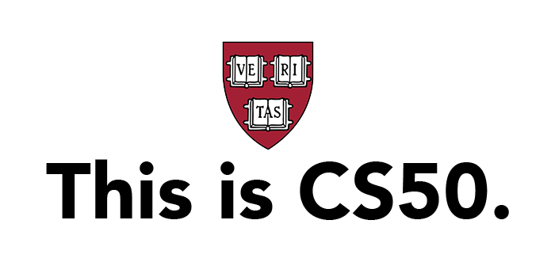

# About CS50

Introduction to Computer Science from Harvard, better known as **CS50**, is the largest course on the Harvard campus and more than 2,000,000 learners worldwide have registered for the course on edX.

CS50 offers a series of introductory courses and Professional Certificate programs from Harvard that are open to learners of all backgrounds looking to explore *computer science*, *mobile app* and *game development*, *business technologies*, and the *art of programming*.

Source: [edx.org/cs50](https://www.edx.org/cs50)

# CS50 Courses

- [CS50x: Introduction to Computer Science](https://github.com/naumanaarif/CS50/tree/main/cs50/x)
- [CS50P: Introduction to Programming with Python](https://github.com/naumanaarif/CS50/tree/main/cs50/python)
- [CS50W: Web Programming with Python and JavaScript](https://github.com/naumanaarif/CS50/tree/main/cs50/web)
- [CS50AI: Introduction to Artificial Intelligence with Python](https://github.com/naumanaarif/CS50/tree/main/cs50/ai)

# Academic Honesty

CS50’s philosophy on academic honesty is best stated as “be reasonable.” The course recognizes that interactions with classmates and others can facilitate mastery of the course’s material. However, there remains a line between enlisting the help of another and submitting the work of another. The course’s policy characterizes both sides of that line.

Read more about it [here]().
